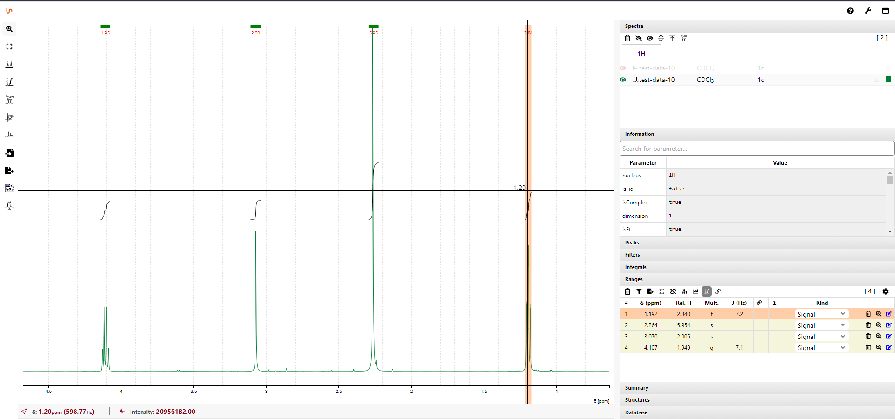

I made quite decent progress in January and have some good news to share. So, here is another blog post. Let's see if I can keep up the pace and make one post every month. Although, at the moment it seems that February might play the other way round.

<!--truncate-->

## Datastore sneak preview

I have put together backend code for uploading data from instrument to the server and tested on one instrument and its quite nice to see that what I have planed actually works quite smoothly. So, here are some key features.

- Upload is carried over HTTP/HTTPS using an additional data upload endpoint in the existing REST-API. Thus, there won't be any additional complexity of the system networking except a very small tweak of NginX configuration which will be covered in documentation once the feature is released.

- Individual experiments are uploaded and stored as single files in compressed .zip format which should make download of data a bit faster. Further advantage could be faster indexing which make any potential transfer of the whole datatore into a new volume significantly less time consuming.

- The times for uploading single experiment that I have seen so far were all shorter than 300 ms. Thus, the data should appear in datastore as soon as the acquisition is finished and data is stored locally on the spectrometer without any significant delays that you can experience if you synchronize network drives as we have used to do with the older prototypes.

- Since the data upload is handled by the NOMAD spectrometer client, that will take data directly from your primary IconNMR data folder, there should be no interference with your existing NMR data storage. In another words, you should be able to run NOMAD in parallel with your existing data archiving solution if you will want to.

## Video tutorials

However, I hope that seeing NOMAD in action can help some people to understand better how the whole system actually works. Therefore, I started to record short video tutorials that demonstrate certain functions of NOMAD system. The first one shows how to connect spectrometer client to the newly installed NOMAD and monitoring a run of few experiments while feeding meta data into the database using AUTO-FEED function. You can watch it **[here](../docs/video-tutorials)**

## NMRium integration

Ultimate goal for NOMAD is to create a seamless workflow that would take NMR data from inception to publication. In order to achieve this goal, there is a need for a tool that would allow to view, analyse and process NMR data in the web browser. It does not need to offer full spectrum of functions that typical desktop NMR processing does nowadays but it should fulfil let's say 90% of needs of everyday liquid NMR user/chemist. In another words, the tool should provide enough utility that NOMAD users don't need to download the data to their desktop computer but do all the processing and analysis on the platform where all the work can be easily stored, shared and archived.

We have done some work on such tool and partially implemented in version 2 prototype. While working on the datastore I started to think about NMR processing and viewing tool as the one that we already developed would be cumbersome to integrate with the new React frontend. Developing a new tool with all these requirements would be a gargantuan task but I was ready to tackle it slowly even though it would probably take years to get something that would tick all the boxes. Luckily, to my huge surprise I stumbled upon a project called **[NMRium](https://www.nmrium.org/)** which seems to be absolutely perfect fit for NOMAD needs. Moreover, the project is open source on **[GitHub](https://github.com/cheminfo/nmrium)** under MIT license and also available as React component on **[NPM](https://www.npmjs.com/package/nmrium)**. All that makes integration with NOMAD very feasible and if successful it could help NOMAD to make massive leap on its road map.

To conclude, I would say that I can look at NMRium from perspective of NMR spectroscopist and Javascript developer as well and either way I am truly impressed. Im my opinion NMRium, could easily be a game changer not only for NOMAD but also for quite few niches of NMR spectroscopy.
