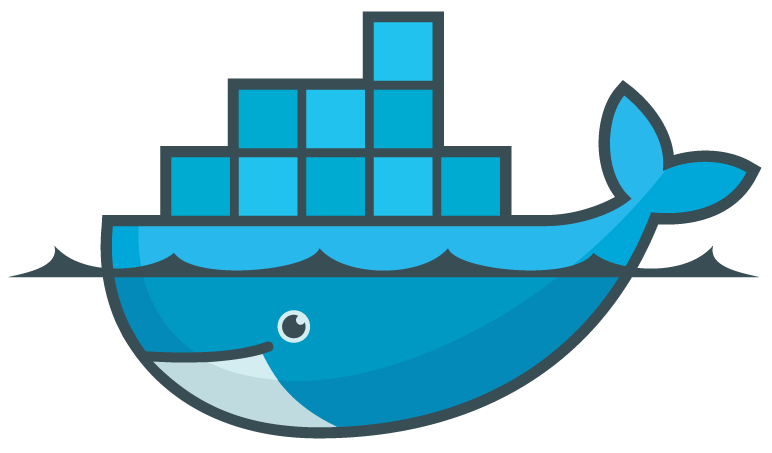

It has been a while since my last post here. I had to take some time off over the summer but did not stop pushing things forward. I was working on two major updates that have been included in **[version 3.2.0](https://github.com/nomad-nmr/nomad-server/releases/tag/v3.2.0)** released on GitHub last week. Keep reading if you want to find out more about the whale.

<!--truncate-->

The whale above is the logo of **[Docker](https://www.docker.com/)** which is a wonderful piece of technology that incredibly accelerates building, sharing and running modern web applications. It does not really bring any new features that could be appreciated from users' perspective but it allows me to share, what I do in my development environment, effortlessly and consistently with other people. Firstly, it allows me to easily share my development environment with other developers but more importantly it enables to build and update servers really quickly. To simplify things on the development side even further, the former repositories **nomad-front-end**, **nomad-nmrium** and **nomad-rest-api** were merged into one repository **[nomad-server](https://github.com/nomad-nmr/nomad-spect-client)** that holds all server side code. The spectrometer client is kept in its own repository but can run in Docker container that can be started together with the server containers in development environment. All details are covered in documentation **[For Developers](../docs/getting-started/for-developers)** and **[Server Installation](../docs/getting-started/server-installation)**.

Simplified server installation also allowed me to easily clone the NOMAD server and spin out a **[demo server](http://demo.nomad-nmr.uk)** that runs in a public domain. You can see the system from the users perspective and browse through data that were uploaded from one of our machines. Moreover, it's fully functional demo with own database rather than a snapshot of St Andrews system. Thus, anybody can connect own Bruker instrument and run some spectra through it to have proper experience of using the system. There is a step by step guide in **[documentation](../docs/getting-started/tips)** that shall lead you through the process.

The last news is a feature that allows for calculating instrument usage and associated cost. The calculation can be performed for any range of days for either whole research groups or individual users. This feature eventually allowed me to disconnect all machines from the old prototype that is now used only for accessing old data.

That's it for just now but there is more coming through.
