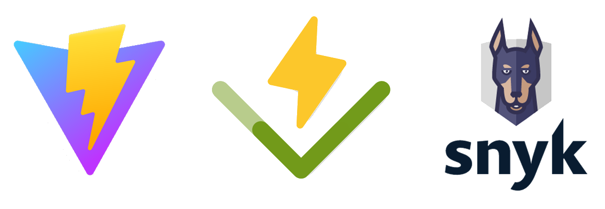

It has a been a while since I made the last post here. Last autumn was generally busy with many things. Moreover, I entered few rabbit holes and it took me a while to get through and wrap everything into the new release. The version v3.2.2 brings only very small changes that can be seen from the user perspective. However, some rather substantial changes were done under the hood.

<!--truncate-->

Following Docker implementation, I have been planing to make some other changes to the project infrastructure to make whole project more robust before I move on to add more features and make the codebase much bigger. So, what changes have been done?

## Fronted tooling

Apart from few bugs being fixed, users can notice that **[NMRium](https://www.nmrium.org/)** has been wired in slightly different way. Currently, the changes are very negligible but in order to utilise NMRium React component with its full potential the whole React fronted was refactored using new fronted tooling **[Vite](https://vitejs.dev/)**. Changing React development environment was in the back of my mind for a while and there was more than one reason that pushed in that direction. The release of **[Ant Design](https://ant.design/)** version 5 was another reason for the major frontend refactoring. So, I undertook these two simultaneously at the end of last year and I am very pleased with the result.

## Automatic testing

The whole NOMAD codebase is getting bigger and bigger and to carry on development without any automatic testing becomes increasingly more dangerous. Implementing automatic testing in this stage of the project will likely take a while unless I drop everything else. After a bit of learning and research I started with backend API automatic integration and unit testing using **[Vitest](https://vitest.dev/)** and **[SuperTest](https://www.npmjs.com/package/supertest)**. Using **[Vitest](https://vitest.dev/)** also forced me to refactor exports/imports from commonJS to ES modules which has been at the back of my mind for awhile. Currently, the tests cover only about 45% of backend API code but the idea is to add more tests over time. Once the API is sufficiently covered I would like to use the same set up for the spectrometer client tests and then have a look at React fronted and end-to-end testing. As I said it will take a while to cover whole project with automatic tests but it's in the works and with every witten test the project becomes more and more robust.

## Security scanning

It seems that one of the big hurdles for NOMAD adoption is a lack of trust from IT services in host institutions. Therefore, I started to seek a tool that could be used to scan the whole project for any security vulnerabilities. **[Snyk](https://snyk.io/)** is a tool that caught my eye as it enables to find and quickly fix vulnerabilities in various stages of development as it integrates with many developer tools and workflows. Such as automatic testing, **[Snyk](https://snyk.io/)** integration is work in progress. However, I have already implemented the tool in my development environment and fixed all severe vulnerabilities that I could find.

---

Last but not least, it has been shown that **NOMAD** works fine with the latest generation of Bruker consoles and TopSpin 4. You can check that on our **[demo server](http://demo.nomad-nmr.uk/)**.
