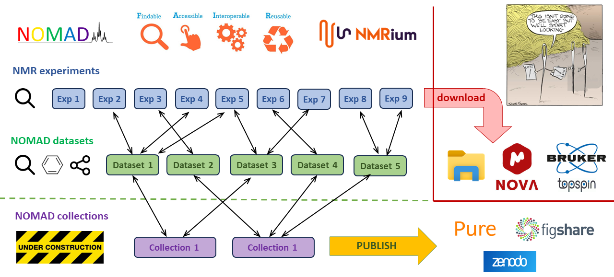

I have just released a new version of NOMAD on GitHub. The version 3.4.0 brings the concept of datasets which is another huge milestone on the roadmap. I have been beta-testing the new features since September. Thus, I have got plenty of experience and thoughts that I can share here with you.

<!--truncate-->

So, let me explain why I suppose the datasets to be such big milestone in NOMAD development. In my opinion, the version 3.4.0 demonstrates the key concepts that could allow for maintaining NMR data **[F.A.I.R](https://www.go-fair.org/)** throughout the whole research process. Already early versions of NOMAD system would archive **[F.A.I.R](https://www.go-fair.org/)** NMR data. However, the research process is usually rather long and sometimes even few years can pass between acquisition and publication while NMR data drop **[F.A.I.R](https://www.go-fair.org/)** status as soon as researches download the data into their computers where they would process data further or cherry-pick and combine data into new folder structures or closed format files. This workflow usually leads into troublesome attempts to make the NMR data **[F.A.I.R](https://www.go-fair.org/)** again at the publication stage.

NOMAD version 3.4.0 now offers alternative workflow. The dataset feature enables cary on the cherry-picking process directly on the platform without downloading the data. Users can simply open data in **[NMRium](https://www.nmrium.org/)**, select experiments that they want to keep together, add additional metadata including molecular structures, carry on any NMR processing that they can do in **[NMRium](https://www.nmrium.org/)** and then save the resulting dataset with better findability back in NOMAD datastore. Datasets are searchable by wide range of metadata including molecular structure and substructure. The datasets can be reopened in **[NMRium](https://www.nmrium.org/)** on NOMAD platform for further editing and processing or downloaded in original Bruker format for viewing and processing in other software. Users can also generate link that they can pass on other users or paste it in documents or ELN to allow for quick access to the dataset.

I have tested this concept with few of my colleagues in St Andrews for couple of months and we have found the new workflows definitely viable. Moreover, I can see some of them being enthusiastic to work with NMR data in new and better way. It seems that easiest people to covert are the students in the teaching labs as they don't have any past experience with NMR. However, there is still plenty of users who remain rather lukewarm and easily slip back to the old habits. Obviously, seeing this is a bit discouraging but I suppose NOMAD to be a pursuit of a new paradigm shift which is never an easy process.

If you have been around long enough then you can remember times when every single NMR spectrum would get printed on a piece of paper. That was definitely the case when I took over the NMR lab in St Andrews in 2004. Doing something like that seems absolutely preposterous from the current perspective. The fact that it took us nearly decade to completely retire printing is even more ridiculous. Even though that we don't print spectra on piece of paper any more we still degrade NMR data by conversion into images or closed data formats. So, lets see how long it will take to cease this digital printing and to make the next step in evolution of NMR data handling.
