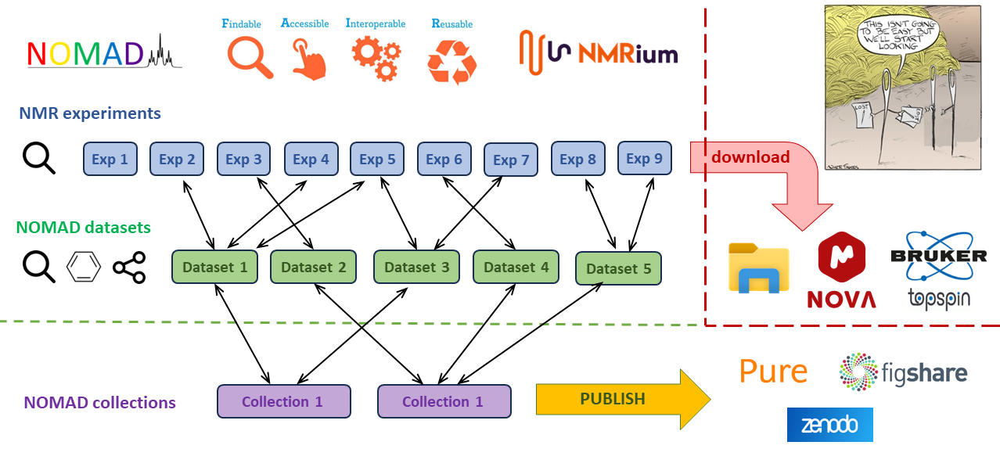

We're thrilled to announce the release of NOMAD System Version 3.5.0, a significant milestone in our journey toward revolutionizing NMR data management. With this new version, we introduce the highly anticipated feature of collections which complements the pursuit of refactoring of all features from Version 2 into entirely new codebase.

<!--truncate-->

At its core, NOMAD empowers researchers to organize NMR datasets into comprehensive database constructs known as collections. These collections serve as the digital equivalent of supplementary information for scientific publications. In essence, NOMAD allows now for the seamless management of NMR data throughout the entire research lifecycle, from inception to publication, while adhering to the principles of Findable, Accessible, Interoperable, and Reusable (**[F.A.I.R.](https://www.go-fair.org/)**) data.

Despite the remarkable capabilities of NOMAD, we acknowledge that embracing this paradigm shift can be challenging. Many users are still accustomed to downloading data onto their computers and processing them using desktop software, rather than entrusting them to cloud-based platforms like NOMAD. However, this reluctance to fully adopt NOMAD can lead to the loss of F.A.I.R. principles, hindering the progress of research and collaboration.

With Version 3.5.0, we aim to bridge this gap by not only introducing collections feature but also by continuing to enhance the user experience and functionality of NOMAD. Our goal is to make the transition to NOMAD as seamless as possible, ensuring that researchers can leverage its full potential without sacrificing familiarity or convenience.

In conclusion, while it may be challenging to teach old habits new tricks, the release of NOMAD System Version 3.5.0 represents a significant step forward in our mission to promote data integrity, accessibility, and collaboration within the scientific community. We invite you to explore the new features and capabilities of NOMAD and join us in embracing the future of NMR data management.

Stay tuned for more updates and enhancements as we continue to evolve NOMAD to meet the ever-changing needs of researchers worldwide.
