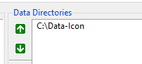
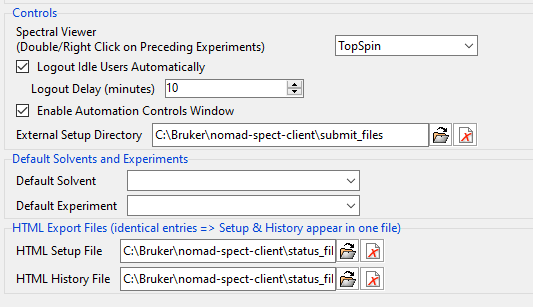
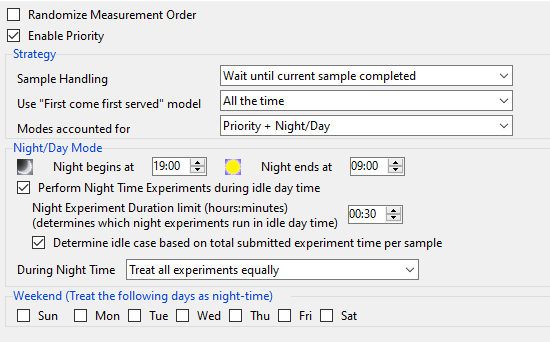

# IconNMR Configuration

## Data path

After fresh installation of the server there is one user in the database _(username: admin , group: default)_. If you want to quickly test the system using this default user account, you need to create IconNMR user **_default_** and set its `Data Directories` to a directory of your choice. For example `C:\Data-Icon` and then set spectrometer client variable `nmrDataPathAuto` accordingly (see **[NOMAD spectrometer client configuration](./client-installation/#config)**)

How to create groups in NOMAD database that match your current IconNMR settings is described in **[NOMAD Configuration](./nomad-config/#add-groups)**.

## Status & history

Set paths to status/history html files and external setup directory in **_IconNMR configuration/Automation/Automation Window_**

:::caution
The paths here are absolute and need to match corresponding relative paths that are set in **[NOMAD spectrometer client configuration](./client-installation/#config)**.
:::

## Priority

If you want to use Day/Night and Priority features of NOMAD traffic control. You have to enable those in **_IconNMR configuration/Automation/Priority_** and use other settings according to your needs.

:::danger
For submitting samples to IconNMR through the external setup directory, the IconNMR automation window has to be open by user with "Supervisor" permissions. In the case of standard TopSpin/IconNMR installation you could use **_nmrsu_** user.

Alternatively, it can be any other user with "Supervisor" permissions that you have created.

:::
