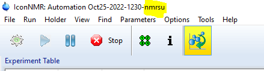

# IconNMR Configuration

1. After fresh installation of the server there is one user in database (username: admin , group: default). To get started, you need to create IconNMR user _default_ and set "Data Directories" to a directory of your choice. For example _C:\Data-Icon_

   

   If you create more groups in NOMAD database later (see **[Tips & Tricks](./tips)**). For each new group, you have to create a new IconNMR user with a corresponding name and the same data directory.
   Alternatively, if your IconNMR users corresponds to your research groups, you need to set up groups in NOMAD database with matching group names and then set spectrometer client variable _nmrDataPathAuto_ accordingly (see **[NOMAD spectrometer client configuration](./client-installation/#config)**)

2. Set paths to status/history html files and external setup directory in _IconNMR configuration/Automation/Automation Window_

:::caution
The paths here are absolute and need to match corresponding relative paths that are set in **[NOMAD spectrometer client configuration](./client-installation/#config)**.
:::

3. If you want to use Day/Night and Priority features of NOMAD traffic control. You have to enable those in _IconNMR configuration/Automation/Priority_ and use other settings according to your needs.

   

   :::danger
   For submitting samples to IconNMR through the external setup directory, the IconNMR automation window has to be open by user with "Supervisor" permissions. In the case of standard TopSpin/IconNMR installation you could use _nmrsu_ user.

   

   Alternatively, it can be any other user with "Supervisor" permissions that you have created.

   :::
