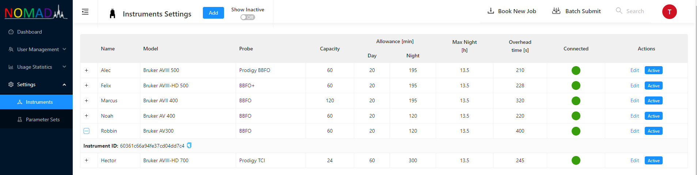

# NOMAD Configuration

You need to start by adding your instruments in the instrument table. In order to do that you need to login with username _admin_ and password that you defined in the **[ecosystem config file](./server-installation/#config-files)** on the server .



Once the instrument is created corresponding Instrument ID has to be entered in **[spectrometer client configuration](./client-installation/#config)**.
:::info
If the spectrometer client is successfully connected. **_Connected_** traffic light turns from red to green.
:::

## Auto-feed {#auto-feed}

If you have IconNMR set up to generate dataset name in generic format XXX-XXX-username (for example $NUMERICDATE-$HOLDER-username) you could start using **[monitoring dashboard](../../features/monitoring)** feature straight away. In order to do that you need to adjust two configuration files on the server and restart the application.

```bash title=/nomad/ecosystem.config.js
SUBMIT_ON: false
```

```bash title=/nomad/nomad-front-end/config/production.env
#Set true if corresponding NOMAD module is used
#----------------------------------------------
#Submission portal
REACT_APP_SUBMIT_ON=false
#Batch submission portal
REACT_APP_BATCH_SUBMIT_ON=false
```

```bash
nginx -s quit
pm2 stop all
cd /nomad/nomad-front-end
npm run build
cd /nomad
pm2 start ecosystem.config.js
nginx
```

If NOMAD runs in this **auto-feed** mode then group, username and parameter set tables get populated with data from your lab. Once you are happy with the snapshot of meta-data that auto-feed created you can switch the **[submission portal](../../features/submit)** on and start to use it after you have done two more things.

1. Enter default parameters (ns, d1, ds, td1, expt) in parameter set table that will allow to estimate experimental time essential for NOMAD traffic control.

   

2. Ask users to rest their password using login modal triggered by clicking on the grey avatar in the top right corner of NOMAD dashboard.

   

:::caution
Password reset requires sending e-mails and won't work without correct SMTP configuration in **[ecosystem config file](./server-installation/#config-files)**.
Secondly, if NOMAD usernames don't match email usernames automatic generating of email addresses form e-mail prefix set in **[ecosystem config file](./server-installation/#config-files)** won't work and you will have to manually populate e-mail addresses in the user table.
:::

:::tip Auto-feed with other data set name format
If you would like to get started with **auto-feed** and use dataset names in different format get in touch! Other formats including tagging users using originator items can be easily implemented.
:::

## Manual configuration

You can also get started with nomad by filling all necessary metadata tables manually.

1. **Group table** - Group name has to match IconNMR username.
2. **User table** - You need to enter correct e-mails otherwise password reset won't work.
3. **Parameter Set table** - Parameter set names are case insensitive and need to match those defined by TopSpin.

:::tip
You don't need to define parameter sets in IconNMR and assign them to groups/users. That can all be done through NOMAD.
:::
