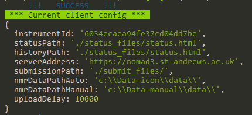

# Spectrometer Client Installation

:::tip Linux Console for Windows
For installation on Windows machines, install **[Cmder](https://cmder.app/)** Linux console simulator. The full version comes with Git for Windows.
Using Cmder will make installation procedure on Windows and Linux machines nearly the same.
:::

The only dependency that you will need to install is **[node.js](https://nodejs.org/en/)**. Installers are available for Windows 10 as well as wide variety of Linux platforms including CentOS used by Bruker on their Linux workstations. Any feedback from attempts to install NOMAD client on an older machines are welcome.

After you have installed **[node.js](https://nodejs.org/en/)**, navigate to the folder where you want to install the client. For example:

```bash
## Windows
cd C:\Bruker
## Linux
cd  /opt
```

Download the latest release of the source code from **[Github](https://github.com/nomad-nmr/nomad-spect-client/releases)** and uncompress .zip or .tar archive

You can also use git command to clone the repository.

```bash
git clone https://github.com/nomad-nmr/nomad-spect-client.git
```

Navigate to the folder with the source code and install JS dependencies

```bash
cd nomad-spect-client
npm install
```

Create folders for status and submit files

```bash
mkdir status_files
mkdir submit_files
```

## Client Configuration {#config}

Before you start with client configuration, you need to create at least one instrument in NOMAD database to get instrument ID.
Then execute configuration script

```bash
npm run config
```

You will need to fill in following entries

- **instrumentId**: Unique ID of the NMR instrument that is generated when entry for the instrument is created in NOMAD configuration.
- **statusPath**: Relative path to IconNMR status.html file. _(./status_files/status.html)_
- **historyPath**: Relative path to IconNMR history.html file. Keep it same as **statusPath** if both IconNMR status and history are written in the same file. Recommended. _(./status_files/status.html)_
- **serverAddress**: URL of your NOMAD server _(https://nomad.my-uni.ac.uk)_
- **submissionPath**: Relative path to IconNMR external set up folder. _(./submit_files/)_
- **nmrDataPathAuto**: Absolute path to IconNMR data folder. _(c:\Data-icon\data\\)_
- **nmrDataPathManual**: Absolute path to manual data folder. _(c:\Data-manual\data\\)_
- **uploadDelay**: Delay for data upload [ms]. _(10000) If set to short data upload can be triggered before Topspin is finished with processing._

At the end you should see something like this.



_Ctrl + C_ to exit client configuration.
:::caution
The relative paths defined here need to match those set in **[IconNMR configuration](./IconNMR-configuration/)**.
:::

:::info
NOMAD client archives copies of datasets stored in folder defined by **nmrDataPath** variable in the client configuration. Therefore, NOMAD client won't interfere with your existing set up for NMR data archiving and you can run both systems in parallel.
:::

## Start client

Start the client in verbose mode to see if it runs correctly

```bash
npm run verbose
```


### Star client on Windows startup

Create a .bat file

```bash
cd C:\Bruker\nomad-spect-client\src
npm start
```

Then use Windows Task Scheduler as Administrator to execute the .bat file on Windows startup.

## Update client

Stop the client by _Ctrl + C_ or use Windows Task Scheduler

If you installed the client using git clone command then

```bash
git pull
npm install
```

Otherwise download the newer release from **[Github](https://github.com/nomad-nmr/nomad-spect-client/releases)**, uncompress .zip or .tar archive to replace the folder with existing source code and install JS dependencies.

```bash
npm install
```

:::caution GIT PULL FAILS
If git pull command fails very likely some changes were done in the working directory by npm install command.
In that case, stash the changes and repeat pull.

```bash
git stash
git pull
```

:::
