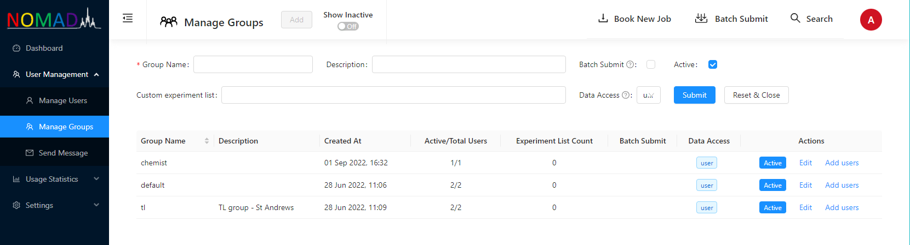
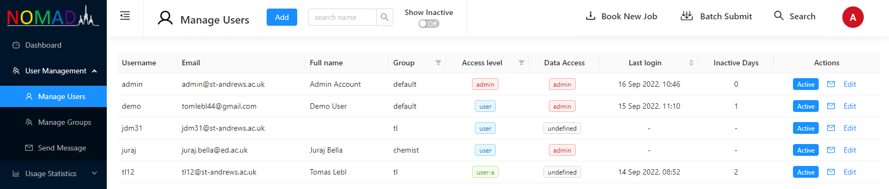
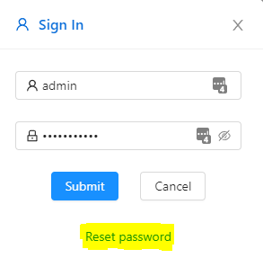
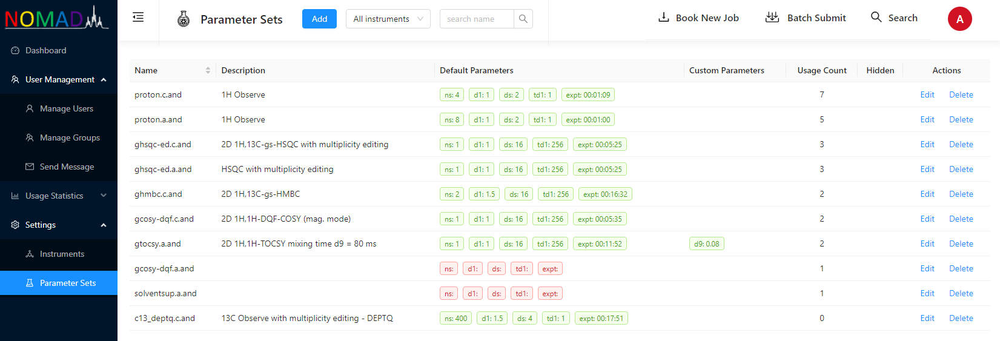

# NOMAD Configuration

This sections contains a guide for essential NOMAD configuration that is required before running your first experiments. NOMAD configuration is available only to users with access level `admin`. When you install your NOMAD server, only one user has been created in the database that has username **_admin_** and password that is defined in environmental variables on the server in `backend.env` file. After you login as user **_admin_** you should see a black side admin navigation side bar on the left hand side of the browser window. There is a button that allows to expand the side bar to show description of admin features rather than icons.

## Instruments

To add an instrument into NOMAD database, go to **_Settings/Instruments_** of the admin menu. Click on the blue button "Add" to open add instrument form. There are only three compulsory entries that you have to fill. There are some others prefilled with recommended values to get you started. Some entries have legend that can be displayed by moving mouse pointer over **(?)** icon. At this stage you don't need any accurate value for overhead time. 200s can be a good starting point. Once you have run few experiments on the instrument, you can edit the instrument entry and run overhead time calculation that will provide more accurate average value.
Once the instrument is created you can find corresponding instrument ID by clicking on **(+)** icon on the left hand side of the instrument entry. The instrument ID has to be entered in **[spectrometer client configuration](./client-installation/#config)**. Once the spectrometer client is successfully connected. `Connected` traffic light turns from red to green.

:::note
You need to refresh or renter the instrument settings page in order to see change in `Connected` traffic light.
:::

## Groups

Groups can be added in **_User Management/Manage Groups_** section of the admin menu. After fresh installation of NOMAD server, only one group **_default_** has been automatically created in the database. You can either quickly test the system using this default user account (see **[IconNMR configuration](./IconNMR-configuration)**) or proceed with configuration of your own system.

To add a new group to NOMAD database, click on the blue button "Add" and fill the form. Here you can encounter two different scenarios.

- **A -** Your IconNMR is currently set in the way that IconNMR user is shared by users from one research group. In this case, you can set NOMAD group names to match IconNMR usernames.
- **B -** Your users have individual IconNMR accounts. In this case, create new IconNMR users that match group names and set NOMAD group names accordingly.

All your IconNMR users coupled with NOMAD need to have `Data Directories` in **[IconNMR configuration](./IconNMR-configuration)** set to the same path that also needs to be set in spectrometer client variable `nmrDataPathAuto` (see **[Spectrometer client configuration](./client-installation/#config)**)

Apart from `Group Name` you can setup some additional properties for each group :

- **Batch Submit** : group restricted to use only submission through batch submission racks
- **Data Access** : `user` - users within the group can see only own data, `group` - users can see data of other users within the group, `admin-b` - users can see data of other users in batch submission groups, `admin` - users have unrestricted access to data.
- **Custom experiment list** : if defined then users within the group can access only experiments on this list. Otherwise users have access to all experiments defined for the instruments.

:::note
Custom experiment list cannot be populated if there are no **[Parameter Sets](nomad-config.md#parameters-sets)** defined in NOMAD database.
:::

## Users

### Adding individual users

You can add individual users through **_User Management/Manage Users_** section of the admin menu. Click on blue button "Add" to open add user form. Apart from self-explanatory properties `Username`, `Email`, `Full name` and `Group` you can set

- **Access level**: `admin` - user has access to all parts of the system and is unaffected by the traffic control, `user` - ordinary user of walk-in service, `user-a` - ordinary user of walk-in service who can bypass traffic control, `user-d` - user with access to datastore only, `user-b` ordinary user of batch submission group, `admin-b` - user with access to administration of batch submission racks.
- **Data access**: allows to overwrite settings defined for the whole group (see above). If this property is left undefined group settings will apply.
- **Manual**: user can claim manual datasets

### Adding groups of users

You can also add groups of users through **_User Management/Manage Groups_** section of the admin menu using _.csv_ files. In **_Actions_** column of **_Manage Groups_** table click on "Add users" to open dialogue for uploading the _.csv_ file from the filesystem of your computer. The routine supports two formats of the file

- File has one column only with usernames. In this case, e-mail is not defined but created from username and e-mail suffix that is defined in `backend.env` file on the server.
- File has two columns. The first one with usernames and second one with e-mails.

:::note
Columns in .csv file should not have any headers.
:::

### Password reset

All newly created user accounts are password protected. Therefore all new users have to reset their passwords via their e-mail. The routine for resetting password is triggered by clicking on "Reset Password" link in **Sign In** modal that opens after clicking on the grey avatar in the top right corner of NOMAD user interface. Users have to provide their username and then NOMAD sends reset password link to the e-mail address that is associated with provided username in the database.

## Parameters Sets

Parameter Sets are defined in **_Settings/Parameter Sets_** section of admin menu. Click on the blue button "Add" to open add parameter set form. The only required field in the form is **Name** that has to match a name of parameter set defined in TopSpin and is accessible via `rpar` command. Furthermore, following properties can be defined.

- **Description**: description of the experiment that is defined by the parameter set
- **Available On**: enables to assign parameter sets to instruments
- **Hidden**: hidden parameter sets are available only tu users with `admin` access level
- **Default Parameters**: `ns`, `d1`, `ds` , `td1` and `expt` have to be defined here to allow NOMAD to estimate experimental time required for submission traffic control. The values have to match those defined in TopSpin parameter of the same name.
- **Custom Parameters**: Parameters that users are allowed to change at submission alongside with default parameters `ns` and `d1`. The default values have to match those defined in TopSpin parameter of the same name.

:::note
Parameter sets have also a property **_Usage Count_** which is used to order parameter sets in all dropdown input menus in NOMAD user interface. In that way, most frequently used parameter sets come always on the top of the list.
:::
