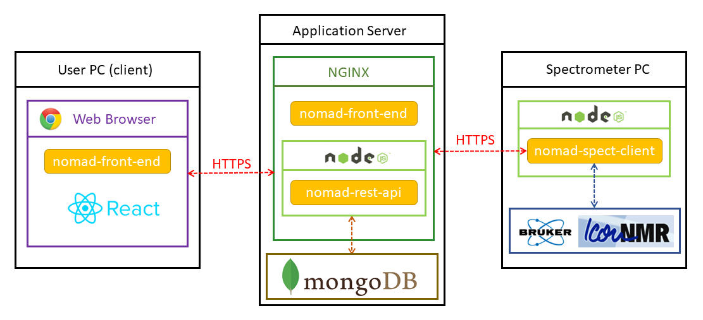

# System Overview

NOMAD is a web application that has been programmed using **[Javascript MERN stack](https://www.educative.io/edpresso/what-is-mern-stack)**. The whole app is composed of three parts and corresponding code is stored in three individual GitHub repositories.

:::tip
If you are a Javascript developer familiar with MERN stack then likely there is nothing new for you in this section.
:::

## nomad-front-end

This part of the system works as graphical user interface of the whole application. It is so called single page application (SPA) that was built using **[REACT JS library](https://reactjs.org/)**. The compiled production build is served by a webserver (**[NGINX](https://www.nginx.com/)**) as static content web site, runs in web browser on user's computer and communicates with the application back-end via standard Internet communication protocols (HTTP/HTTPS).

## nomad-rest-api

This repository contains back-end code of the NOMAD system built using **[Express JS library](https://expressjs.com/)**. It runs on the application server in **[Node.js](https://nodejs.org/en/)** runtime environment and serves as REST API with the purpose to fetch and store application data using **[MongoDB](https://www.mongodb.com/)**. The communication with clients over HTTP/HTTPS protocol is facilitated by reverse proxy provided by a webserver (**[NGINX](https://www.nginx.com/)**)

## nomad-spect-client

The spectrometer client is a Javascript code that runs on spectrometer PC in **[Node.js](https://nodejs.org/en/)** runtime environment and enables communication of NOMAD back-end with Bruker IconNMR. It parses status and history HTML file(s) and outputs files in external setup folder to control automated run of the NMR spectrometer.

