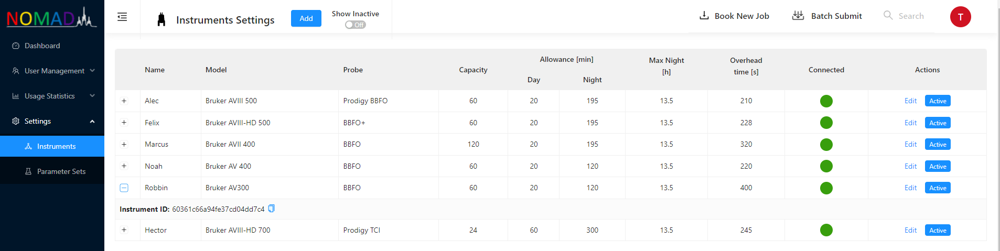
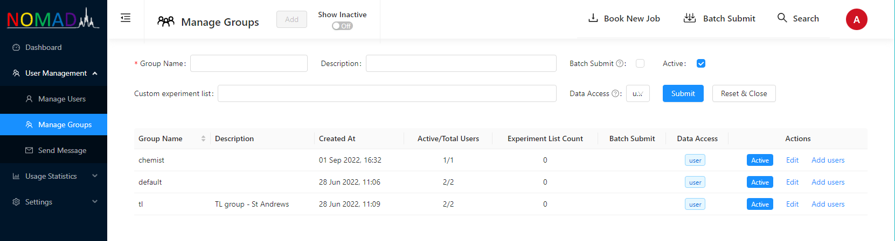
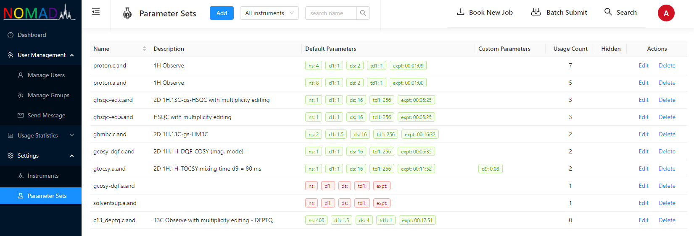
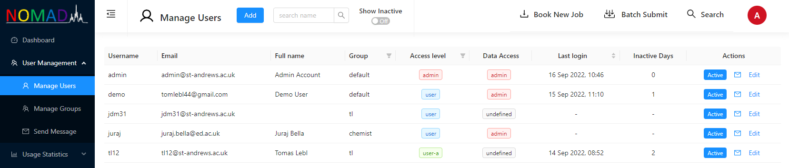
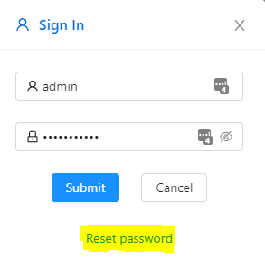
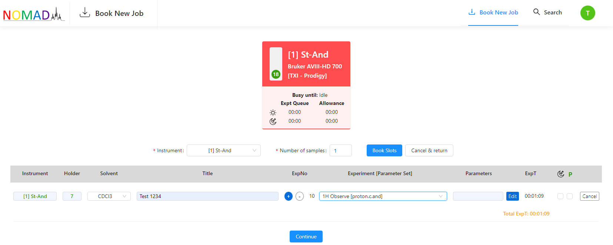
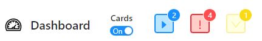
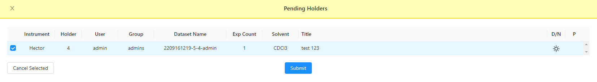

# Tips & Tricks

## 1) Experiment with the client {#tip1}

If you can see **[NOMAD demo server](http://demo.nomad-nmr.uk/)** from your spectrometer workstation then **[contact us](mailto:nomad@st-andrews.ac.uk)** and we will give you access admin privileges. If your lab is blocked from the Internet proceed to the **[next tip](#tip2)**.

- Follow the **[installation instructions](./client-installation.md)** to install the client and **[configure IconNMR](./IconNMR-configuration.md)**.

- Add a new instrument in the instrument table.

  
  Once the instrument is created corresponding Instrument ID has to be entered in **[spectrometer client configuration](./client-installation/#config)**.
  Set some arbitrary allowance times to avoid getting all experiments scheduled for overnight run.
  If the spectrometer client is successfully connected. `Connected` traffic light turns from red to green.

- Add a group with a name that corresponds to one of your IconNMR usernames.

  

- Add parameter set with name corresponding to a parameter set name that is available on the instrument.

  

- Add a user with an arbitrary username into the group that you have just created. User's e-mail should be one that you can access as you will need to reset password via e-mail to use the user's account.

  

- Reset password for the user that you have just created by following the link in `Sign In` modal and then sign in.

  

- In the main menu click on `Book New Job`, select the instrument that you have created, book a slot, fill the experiment form and then click `Continue`

  

- You should be redirect back to dashboard and the request been processed by server you will see a green `Success!` message. Then you need to wait for a moment until IconNMR picks the job up. Once that happens, you shall see a dot at the yellow icon in the top menu.

  

- Put a sample in the holder that have been assigned to you. Then click on the yellow icon, select your experiment and click `Submit`. You will be asked to enter your password.

  

- Shortly you should see the experiment running in the instrument's status table. Once the experiment is `Completed` you can go to search for the data, download and open the spectrum in NMRium.

:::note
You can also set up experiment as your user with admin privileges. You can either submit an experiment on behalf of the user that you have created, by selecting the user in `Book New Job` form or by moving your admin user to the group that you have created.
:::

## 2) Ask IT services for help {#tip2}

Don't hesitate to ask your IT to help you with **[NOMAD server installation](./server-installation.md)** in your domain and set up networking in the way that you can see the server from your instruments. You could go into effort of setting the server by yourself on a Linux box in your lab but there are some serious hurdles along the way related to networking and security. They should be able to help setting up everything properly as all that is in their remit and in their own interest. If they are reluctant to help please **[get in touch](mailto:nomad@st-andrews.ac.uk)** as any sort of feedback can help us to make things better and possibly viable for you as well. If you have got your own server go and **[experiment with the client](#tip1)**.

## 3) Get on with some real users

Once you have your own server and established connection with NOMAD client on one of your spectrometers you should already be familiar with NOMAD basics. Then start with a handful users on one instrument. You can either add those users, groups and parameter sets in the database as you did while playing with the client and start to use submission portal straight away or let users to submit experiments through IconNMR and use **Auto-feed** function.

### Auto-feed {#auto-feed}

In order to bypass NOMAD submission, IconNMR has to be set up to generate dataset name in generic format XXX-XXX-username (for example `$NUMERICDATE-$HOLDER-username`).

:::tip Auto-feed with other data set name format
If you would like to get started with **auto-feed** and use dataset names in different format get in touch! Other formats including tagging users using originator items can be easily implemented.
:::

If NOMAD runs in this **auto-feed** mode then group, username and parameter set tables get populated with data from your lab. In another words, if entry does not exist in the database, then it gets created. Once you are happy with the snapshot of meta-data you can switch to submission through NOMAD and start to use it after you have done two more things.

1. Enter default parameters (ns, d1, ds, td1, expt) in parameter set table that will allow to estimate experimental time essential for NOMAD traffic control.

2. Ask users to rest their password as described above.

:::caution

- Password reset requires sending e-mails and won't work without correct SMTP configuration in **[environmental variables](./server-installation/#env-variables)** on the server.

- If NOMAD usernames don't match email usernames automatic generating of email addresses form e-mail prefix set in **[environmental variables](./server-installation/#env-variables)** won't work and you will have to manually populate e-mail addresses in the user table.

:::

:::tip

If you your use NOMAD for submitting experiments then you can hide IconNMR on spectrometer workstation in a different account and also use multiple computers around the lab for submission.

:::
