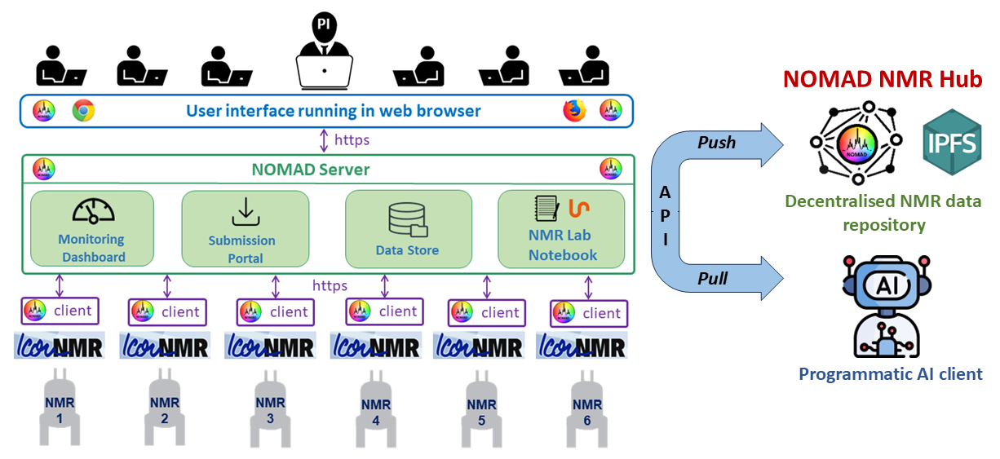

# Introduction

## What is NOMAD?

**NOMAD** (**N**MR **O**nline **M**anagement **A**nd **D**atastore) is a web application that provides a suite of functions that facilitate management of NMR laboratory services with automated walk-up access and in long term aspires to contribute towards the effort of NMR community to preserver and share NMR data.

## Why would you use NOMAD?

1. You are a manager of NMR laboratory equipped with by quite few automated **[Bruker](https://www.bruker.com/en.html)** instruments and in recent years you have experienced dramatically increased throughput of samples in your lab. Consequently, you have got to do a lot of tedious admin work instead of some interesting spectroscopy experiments and science.

2. You get frequently annoyed by your fellow colleagues asking you a question like "_Do you remember those experiments that you did with one of my students about 3 years ago. I would like to publish the results. Do you have the data that you have acquired for us back then?_"

3. You care about long term preservation of NMR data and believe that an equivalent of **[CCDC](https://ccdc.cam.ac.uk/)** for NMR spectroscopy would be a tremendous resource.

## How could NOMAD help with NMR data preservation?

### Problem

- In large NMR facilities multiple NMR instruments automatically acquire and process NMR data that are uploaded on large shared network drive. The automation process is controlled by multiple instances of IconNMR software which makes difficult to associate NMR data with corresponding provenance metadata.

- Users download data data on their personal computers where carry on with processing and analysing the NMR data. Eventually users create a report in MS Word or PDF format that they pass to supervisor or PI who usually don't have access to raw NMR data. At the end, PIs trigger publication process that could easily be many years after some NMR data were acquired. Since PIs don't have access to NMR data they rather avoid NMR data deposition or delegate the uneasy task of looking for needles in the hay stack to a co-worker.

- If NMR data eventually gets deposited they end up in a centralized generic research data repositories such as **[Figshare](https://figshare.com/)** or **[Zenodo](https://zenodo.org/)** which don't provide any search tools and other facilities that would be useful for NMR spectroscopists.

### Solution

- NOMAD spectrometer client connects individual instances of IconNMR with NOMAD server where **_Monitoring Dashboard_** and **_Submission Portal_** functions assure collection of correct provenance metadata.

- The raw NMR data gets collated in **_NOMAD Datastore_** alongside with metadata which enables efficient searching.

- **_NMR Lab Notebook_** with integrated **[NMRium](https://www.nmrium.org/)** enables further processing, analysing and annotating NMR data without downloading data on personal computers.

- All users including PIs access the NOMAD platform with different access rights from they PCs via UI running in a web browser. In another words, there is no need for installation of any software on users' PCs.

- Publication of raw NMR data is done by direct communication between NOMAD server and research data repository API. Hence no information is lost by downloading data to users' PCs.

- The ultimate goal is to have multiple instances of NOMAD running in various NMR labs around the globe that share resources to form a decentralised P2P NMR data repository powered by **[IPFS](https://ipfs.io/)** protocol.

## What is NMR?

:::tip
If you are seasoned NMR lab manager then you won't find anything new in this section.
:::

**Nuclear Magnetic Resonance (NMR) spectroscopy** is an analytical technique used by chemists for quality control and research. It allows to determine the content and purity of a sample as well as molecular structures of unknown compounds. In another words, NMR can either be used to quantitatively analyse mixtures containing known compounds or identify entirely unknown compounds. Furthermore, NMR is utilised to study chemical and physical properties at the molecular level such as conformational exchange, reactivity, solubility and diffusion. In order to achieve that, hundreds of various NMR techniques were developed over the years. Due to high versatility, accuracy and reproducibility, NMR became absolutely essential analytical technique for modern chemistry research.

NMR spectrometers with very strong liquid helium-cooled superconducting magnets are relatively expensive and not easy to maintain. Therefore, they are usually placed in large central laboratories owned by universities or big private companies. However, the recent boom of less expensive bench-top instruments using permanent magnets and lower resolution resulted in expansion of NMR spectroscopy in some smaller and unusual niches.

### NMR spectrum as a finger print

NMR spectrum can be seen as a finger print of the electronic structure of a molecule and its individual functional groups. Therefore, compounds can be identified by comparing their NMR spectra against spectral libraries of already known compounds. Unlike fingerprints, NMR spectra are highly predictable and molecular structure of unknown compound can be deduced entirely from NMR spectroscopy data. However, solving such NMR puzzle is not straightforward, multiple correlation NMR experiments are usually required and complexity increases dramatically with the size of the molecule.

### NMR spectrum as a digital asset

A NMR spectrum in raw digital format can represent a substantial value. Firstly, recording NMR spectra requires significant amount of resources in form of expensive instruments and consumables (cryogens and deuterated solvents) and labour of highly trained employees who run the experiments and maintain the instruments. Furthermore, labour that goes into obtaining the actual substance by synthesis and/or purification can be also considerable. One can see the value from the other perspective as well. Having access to verified source of NMR spectra in raw format can enable faster and more confident identification of substances either in pure state or complex mixtures. That can bring inestimable cost savings for chemical and pharmaceutical industry and chemistry research in general.
The ultimate goal of NOMAD is to create a platform that would allow to preserve NMR data in emerging decentralised **[Web 3.0](https://medium.com/fabric-ventures/what-is-web-3-0-why-it-matters-934eb07f3d2b)** way.
