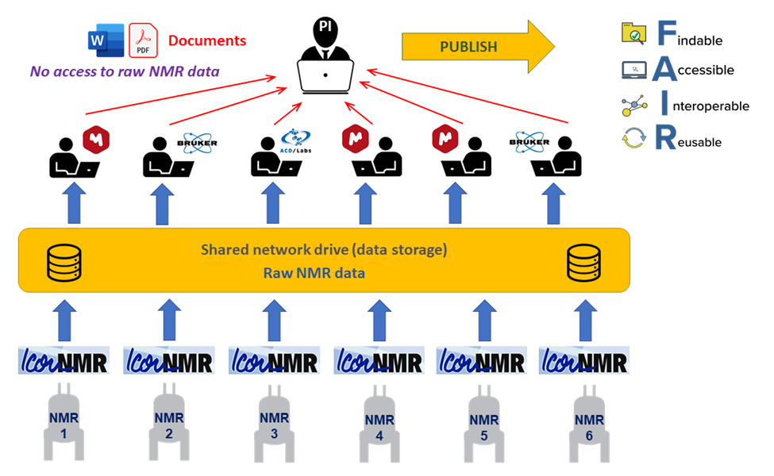

# Technical White Paper

## Abstract

**NOMAD** (**N**MR **O**nline **M**anagement **A**nd **D**atastore) represents a groundbreaking solution for NMR data management, addressing the intricate challenges faced by researchers in NMR spectroscopy. This white paper unveils NOMAD's innovative approach in streamlining data handling, adhering to F.A.I.R data principles, and fostering collaborative research. From its inception, NOMAD was designed as a comprehensive platform to revolutionize NMR data management. It offers a suite of features, including the Monitoring Dashboard for integrated instrument control, the NMR Lab Notebook for seamless data processing, and a Submission Portal for improved lab traffic management. NOMAD's significance is evident in its integration within the University of St Andrews NMR lab. With 200 active users, handling data from six NMR spectrometers, and archiving over 400 NMR experiments daily during peak times, NOMAD's scalability and real-world utility are undeniable. Additionally, our vision extends to forming a decentralized P2P NMR Data Repository, echoing the collaborative success of the Cambridge Crystallographic Data Centre (**[CCDC](https://www.ccdc.cam.ac.uk/)**). NOMAD is open-source, hosted on GitHub, and operates under the Affero General Public License (AGPL-3.0). This collaborative approach ensures NOMAD aligns with evolving research needs. In conclusion, NOMAD redefines NMR data management, facilitating a seamless journey from experiment to impactful research outcomes. NOMAD beckons researchers to shape a new era of collaborative NMR research.

## 1. Introduction

Nuclear Magnetic Resonance (NMR) spectroscopy is a powerful analytical technique used in a wide range of scientific fields. However, managing and sharing NMR data can be challenging due to fragmented data storage and the use of multiple instances of NMR acquisition and processing software. NOMAD is a groundbreaking open-source web application that addresses these challenges by providing an integrated platform for NMR data management, ensuring data provenance, and simplifying data sharing and publication.

## 2. Problem Statement

Efficient management of Nuclear Magnetic Resonance (NMR) data in laboratory settings presents a significant challenge. While NMR spectroscopy is a powerful analytical technique, the data it generates is often complex and voluminous. As researchers strive to adhere to the **[F.A.I.R](https://www.go-fair.org/fair-principles/)** (**F**indable, **A**ccessible, **I**nteroperable, and **R**eusable) research data principles, several obstacles hinder seamless data management and compliance. Data findability and accessibility is hindered by fragmented data storage on users' PCs and reliance on disparate software instances, making it challenging for researchers to locate relevant datasets efficiently. Furthermore, the conversion of NMR data into images pasted in Word or PDF documents for sharing and publication undermines data reusability. Accessibility also faces roadblocks due to the lack of a data repository that would serve as an equivalent to the **C**ambridge **C**rystallographic **D**ata **C**entre (**[CCDC](https://www.ccdc.cam.ac.uk/)**) for NMR data, leading to restricted access to already published NMR data and limited collaboration.

## 3 The NOMAD Solution

NOMAD offers a transformative solution for NMR data management that streamlines the adherence to **[F.A.I.R](https://www.go-fair.org/fair-principles/)** principles. NOMAD serves as an end-to-end data management solution, taking NMR data from its inception through the entire research process until publication. Researchers can initiate experiments via the Submission Portal, record and analyze NMR data using the NMR Lab Notebook powered by **[NMRium](https://www.nmrium.org/)**, and securely store the data and metadata in the platform's Data Storage feature. This seamless workflow eliminates the need for data downloads to users' PCs and ensures that a direct link to raw NMR data is maintained at every stage of the research journey.

Moreover, NOMAD's vision extends beyond the immediate horizon. Envisioning a future of collaborative innovation, NOMAD aspires to establish a decentralized peer-to-peer NMR Data Repository powered by the **[IPFS](https://ipfs.tech/)** protocol. In this visionary approach, multiple NOMAD instances from diverse NMR labs globally converge to form a robust network, enabling seamless sharing of resources, data, and metadata. This innovative concept fosters a global community of researchers, facilitating the exchange of knowledge and catalyzing scientific advancements within the NMR domain. NOMAD's future vision aligns harmoniously with its present-day functionalities, aiming to drive collaboration and democratize NMR data management.

## 4. Key Features

### 4.1 Monitoring Dashboard

NOMAD's Monitoring Dashboard brings together control of all NMR instruments in the laboratory into one centralized and user-friendly interface. Lab managers and researchers can effortlessly monitor instrument status, experiment progress, and resource allocation. Real-time notifications and alerts ensure timely actions to maintain efficient NMR operations. The Monitoring Dashboard also includes additional features for usage statistics and experimental time accounting. Lab managers can access comprehensive usage statistics, tracking the frequency and duration of experiments performed by individual users. Time accounting capabilities enable accurate and transparent reporting of experimental time used by each researcher. This data-driven approach enhances resource allocation and enables productivity assessment.

### 4.2 Submission Portal

The Submission Portal streamlines and centralizes NMR lab traffic. Researchers can easily submit their NMR experiments through the portal, reducing manual intervention and preventing scheduling conflicts. The portal also enables lab managers to efficiently allocate resources and prioritize experiments, leading to optimized instrument usage.

### 4.3 Data Storage

NOMAD offers automatic upload and storage of NMR datasets to ensure seamless data preservation. By associating raw NMR data with corresponding provenance metadata, data integrity and traceability are guaranteed. Researchers can access their data securely and conveniently at any time, eliminating the need for local storage and the risk of data loss.

### 4.4 NMR Lab Notebook

NOMAD's NMR Lab Notebook provides a comprehensive tool for viewing and processing NMR data using **[NMRium](https://www.nmrium.org/)**, a cutting-edge open-source NMR data visualization and analysis software. NMRium's user-friendly interface empowers researchers to perform sophisticated NMR data processing, spectral analysis, and structure elucidation directly within the NOMAD platform which simplifies the data preparation process for publication and maintains data traceability.

## 5. Future Vision - Decentralized P2P NMR Data Repository

NOMAD's journey extends beyond its current capabilities, encompassing a visionary evolution in NMR data management. A central tenet of this evolution is the establishment of a decentralized peer-to-peer NMR Data Repository, underpinned by the cutting-edge **[IPFS](https://ipfs.tech/)** protocol. This ambitious vision redefines collaboration and accessibility within the NMR community, akin to the transformative role that the **C**ambridge **C**rystallographic **D**ata **C**entre (**[CCDC](https://www.ccdc.cam.ac.uk/)**) played in the realm of crystallography.

The NOMAD network, fueled by multiple instances across global NMR labs, converges into a cohesive ecosystem, effectively forming a decentralized repository. This repository thrives on the principles of decentralization, enabling seamless sharing of resources, data, and metadata. Researchers, much like with **[CCDC](https://www.ccdc.cam.ac.uk/)**, gain unparalleled access to a wealth of NMR data that transcends geographical and institutional boundaries.

As a result, the NOMAD community fosters collaboration on an unprecedented scale. Researchers can draw insights from diverse datasets, accelerating scientific discoveries and breakthroughs. Moreover, NOMAD's commitment to the F.A.I.R principles finds resonance in this future vision – the repository will inherently embody Findability, Accessibility, Interoperability, and Reusability, driving data-driven advancements in NMR research.

The integration of ideas inspired by **[CCDC](https://www.ccdc.cam.ac.uk/)** is a pivotal aspect of this vision. Just as **[CCDC](https://www.ccdc.cam.ac.uk/)** revolutionized crystallography by providing a centralized platform for crystal structure data, NOMAD aspires to provide a global, community-driven platform for NMR data. The collaborative spirit of NOMAD's decentralized repository aligns with the aspirations of the research community, epitomizing the power of collective knowledge and shared resources.

In essence, NOMAD's future vision transcends its role as a platform; it aspires to be a catalyst for global knowledge exchange, fostering interdisciplinary collaboration and fueling the frontiers of NMR research. By channeling the spirit of **[CCDC](https://www.ccdc.cam.ac.uk/)**'s success story, NOMAD seeks to usher in a new era of accessible, collaborative, and transformative NMR data management.

## 6. Technology Stack

NOMAD is built on a robust and modern technology stack that ensures seamless functionality, security, and scalability. Leveraging a combination of cutting-edge tools and frameworks that provides a reliable and user-friendly experience for NMR data management.
NOMAD has been developed using the Javascript MERN stack, comprising **[MongoDB](https://www.mongodb.com/)**, **[Express.js](https://expressjs.com/)**, **[React.js](https://react.dev/)**, and **[Node.js](https://nodejs.org/en)**. Additionally, it leverages the **[AntD](https://ant.design/)** design library for seamless and visually appealing user interfaces. **[NGINX](https://www.nginx.com/)** web server and reverse proxy enable efficient load balancing and secure connections. The implementation of **[Redux](https://redux.js.org/)** and **[WebSockets](https://socket.io/)** ensures real-time data synchronization and smooth user interactions. Moreover, NOMAD is containerized using **[Docker](https://www.docker.com/)**, facilitating easy deployment and scalability.
All communication between clients and the NOMAD server, including NMR data transfer, is carried out exclusively over HTTPS. This encrypted communication protocol guarantees the confidentiality and integrity of data transmissions, safeguarding sensitive research data from unauthorized access or tampering.

## 7. Open Source and Licensing

NOMAD's source code and development are hosted on **[GitHub](https://github.com/nomad-nmr)** under the terms of the Affero General Public License (AGPL-3.0). This license guarantees that any modifications or improvements made to the codebase must be made available to the public. NOMAD's foundation in open-source collaboration, supported by its presence on **[GitHub](https://github.com/nomad-nmr)**, underscores its commitment to shared advancement. By inviting the global research community to engage, NOMAD paves the way for a collaborative transformation of NMR data management.

## 8. NOMAD in Action: Real-world Application and Collaborative Expansion

NOMAD has seamlessly integrated into the University of St Andrews NMR lab, becoming a cornerstone of its data management strategy. With utilization spanning six NMR spectrometers, the platform efficiently handles diverse research needs. With around 200 active users benefiting from its streamlined workflows. During peak periods, NOMAD impressively archives over 400 NMR experiments daily, showcasing its scalability and robust performance. This adoption has resulted in enhanced research productivity. By centralizing data, simplifying organization, and reducing administrative burdens, NOMAD empowers researchers to focus on deriving insights from their experiments.

NOMAD's success at the University of St Andrews NMR lab fuels a broader ambition. We are actively pursuing collaborations with other NMR labs, seeking to replicate the seamless integration and benefits realized. Our ultimate vision includes weaving these labs into a decentralized peer-to-peer NMR Data Repository, fostering global collaboration and resource-sharing.

## 9. Conclusion

**NOMAD** (**N**MR **O**nline **M**anagement **A**nd **D**atastore) stands as a pioneering solution in NMR data management, addressing challenges faced by researchers globally. Our exploration has revealed NOMAD's role in simplifying complex NMR data handling, aligning with **[F.A.I.R](https://www.go-fair.org/fair-principles/)** data principles. NOMAD's array of features, from the Monitoring Dashboard to the NMR Lab Notebook, empowers researchers to navigate the data lifecycle with ease. It bridges the divide between data generation and impactful research outcomes. Our experience at the University of St Andrews NMR lab underscores NOMAD's real-world utility, catering to active users and archiving numerous experiments daily. In conclusion, NOMAD revolutionizes NMR data management, enabling researchers to focus on insight extraction. As we move forward, NOMAD invites you to partake in reshaping NMR data management, driving collaboration, and unlocking the next wave of scientific discoveries.
